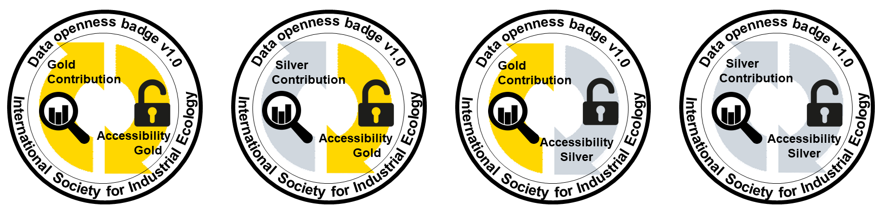

Data Openness Badges
====================

1. Objective and Overview
-------------------------

The aim of the data openness badges is to reward authors whose articles
exhibit higher levels of data openness, accessibility, and
interoperability between data formats beyond the strict minimum for
publication. The International Society for Industrial Ecology thus
strives to promote the contribution of reusable and interoperable data
in a wide range of research context ([Hertwich et al. 2018](https://doi.org/10.1111/jiec.12738)).

The badge is optional. It aims to be flexible, with two dimensions
rewarding (1) the extent of data contribution and (2) the level of data
accessibility, that is, the interoperability and reusability of the data
supplied. It also aims to be progressive, with two levels, gold and
silver, for each dimension. As illustrated below, these
two dimensions and two levels lead to four distinct badges.

{ width=800px }

The following table summarizes the evaluation criteria, which are then
explained in greater detail in the following sections.

|       |Data contribution   |Data accessibility|
|-------|:-------------------|:-----------------|
| Gold   |Entire system description is contributed|Human & machine readable, **and** directly importable into free analysis software |
| Silver |*Option 1*: Detailed, useful, and self‐contained descriptions of significant parts of the system;  *Option 2*: Total exchanges of the technological system with the environment published in an uncharacterized form | Human & machine readable, **or** directly importable into free analysis software |

*Articles that involve important contributions of new data, please also consider submitting accompanying [Data Descriptor](dataDescriptor_guidelines.md) and / or [Software Descriptor](software_article_guidelines.md) articles.*

2. Data Contribution
--------------------

This badge rewards contribution of quantitative data on industrial
ecology that can potentially be reused in other studies. For both gold
and silver levels, the data are to be published under a *free,
open-content license* that explicitly allows use, distribution, and
production of derivative work, such as Creative Commons’ Public Domain
(CC0), Attribution (CC-BY), and Attribution ShareAlike (CC-BY-SA)
licenses. These data should be published in a scientific repository
(e.g., Figshare, Zenodo) and cited with their DOI in the article;
although exceptions may be made for exceptionally small data sets, which
could be published in SI.

### Data Contribution: Gold

The gold level indicates that the *entire system description* is
published at the same level of resolution and completeness as was used
by the authors to calculate their results.

-   These system descriptions notably include, as applicable, the
    descriptions of all processes, activities, agents, objects, flows,
    stocks, exchanges with the biophysical environment, system
    boundaries, and behaviors and actions, *along with links to external
    or secondary data sets (including licensed databases)*.
-   All the primary data and the necessary data citations are made
    available such that the results could be reproduced, although the
    authors are not required to share all detailed calculation and
    analysis steps that were performed using the system description.

    -   **Example 1:** A global input-output footprint analysis links to
        an open and accessible system description including the matrix
        of technical requirements, exchanges with the environment, final
        consumption, and value added, as used in the footprint
        calculations.
    -   **Example 2:** An LCA study makes available its foreground (all
        process descriptions based on own research and primary data) and
        also publishes all the links to a published data set (e.g.,
        ecoinvent) for all secondary data used.

### Data Contribution: Silver

The criterion for achieving the *silver data contribution* level is that
a *significant data contribution* be made by the work. Two options for
how this can be achieved and examples are provided below.

**Option 1:** In situations where authors cannot share their entire
system description, for example, when facing confidentiality issues,
they can nonetheless share the detailed description of the non-sensitive
parts of the system.

-   Published datasets would include, for example, complete process
    descriptions, extensive quantifications of stocks and flows, and
    tabulated product compositions.
-   The intent is that *a significant portion of the system analysed is
    described in a self-contained* manner with useful metadata allowing
    for unambiguous interpretation of each data point within the
    published part of the system description.

    -   **Example 1:** An LCA study of a Li-ion battery use may be
        unable to fully describe the assembly of battery cells because
        the data on energy requirements to do this are commercially
        sensitive. This analysis may nonetheless usefully characterize
        unit processes describing at full detail the production of the
        anodes, cathodes, and electrolytes, thereby contributing useful
        primary data to the community.
    -   **Example 2:** Similarly, it may not be possible to publish an
        MFA model in full because it includes data describing material
        stocks that are commercially sensitive. Nonetheless, the authors
        may share an extensive table of the mass and elemental
        composition for many of the stocks and flows in the model, which
        will likely prove useful in other research.

**Option 2:** The second approach to fulfilling the objective of the
silver level applies to studies that link a technological system to a
damage or an impact (e.g., global warming) throughmulti- ple types of
interactions with the environment (emissions and resource use, e.g.,
releases of carbon dioxide \[CO₂\], methane \[CH₄\], and nitrous oxide
\[N₂O\]). Because of the diversity of characterizationmethods to
translate interactions into impacts, the badge recognizes the benefits
for the community of publish- ing the total interactions of the
technological system with the environment in a readily reusable and
uncharacterized format.

-   **Example 1:** An I-O analysis calculating the carbon foot- print of
    nations would provide the results not only in terms of
    characterizedCO2-equivalents, but also in terms of the total
    emissions of the different greenhouse gases (CO2,CH4,N2O, etc.)
-   **Example2:** In the case of an LCA study, a complete LCI of
    elementary flows would be published at the systems process level.
    That means the study would contain the cumulative total for the
    whole life cycle of each type of emission flow and each type of
    resource use.

3. Data accessibility
---------------------

This badge promotes the formatting and structuring of data such that it
facilitates reuse, efficient data integration, and interoperability with
free analysis software.

### Data Accessibility: Gold

For the gold level, the system description must be formatted and
archived such that it is (1) both human and machine readable, *and* (2)
directly importable into free software capable of completing the
relevant IE analysis.

-   *Human and machine readability:* The system is described such that
    it can be read and *understood by humans in plain text files*.
    Examples of such file formats include plain text, comma separated
    values (csv), json, and xml files, but compressed versions of these
    formats are also accepted, such as xlsx and ods spreadsheet formats,
    but *not* the proprietary xlsb or xls formats. The data should also
    be *machine readable* in the sense that a relevant software can
    readily distinguish words from numbers, recognize table structures,
    etc. For example, a system description in a spreadsheet is machine
    readable, whereas a system description in PDF or word processing
    formats (.docx, odt, etc.) is not.

    |                     | Machine readable               | Not machine readable|
    |---------------------|:-------------------------------|:--------------------|
    |Human readable       | txt, csv, json, xml, xlsx, ods | .docx, .odt         |
    |Not human readable   | .xls, xlsb                     | PDF, .doc           |

-   *Direct imports in relevant free software:* The relevant analyses
    can be directly performed on the system description without
    requiring payment for software. Many situations fulfill this
    objective, for example:

    -   Example 1. A system description is exported in a nonproprietary
        structured format (e.g., ecospold XML files) that can be
        imported directly into free software (e.g., openLCA and
        brightway2), which can directly perform the relevant analysis
        (e.g., LCA calculations).
    -   Example 2. Both the data and the calculations of the study are
        fully embedded in a spreadsheet (e.g., ods, xlsx file),
        requiring no external software to complete the analysis. If this
        spreadsheet can be opened in a free office suite (e.g.,
        LibreOffice) without loss of functionality, it fulfills the
        requirement.
    -   Example 3. A study publishes not only the data, but also the
        (free) software to parse and analyze it (e.g., a Python script).

### Data Accessibility: Silver

For this badge, the system description must be formatted such that it
can fulfill at least one of the two criteria of the Accessibility Gold
badge: It must either be directly readable by humans and machines, *or*
be directly importable in a relevant free analysis software.

Examples

-   .zmfa files produces by the free MFA software STAN (Accessible with
    free software, but not human readable).
-   A Microsoft Excel xlsx spreadsheet with advanced computations/macros
    that cause compatibility issues (human and machine readable, but not
    importable without loss of functionality in free software, such as
    LibreOffice).

